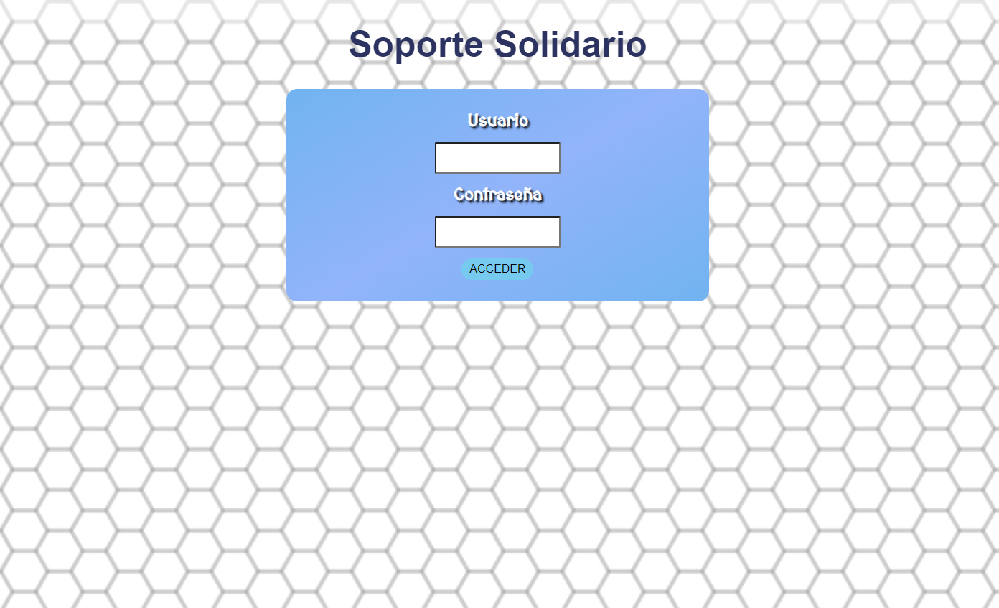
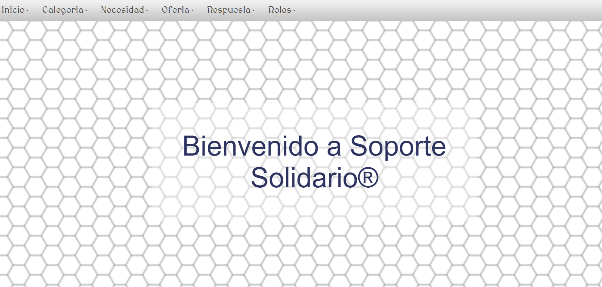
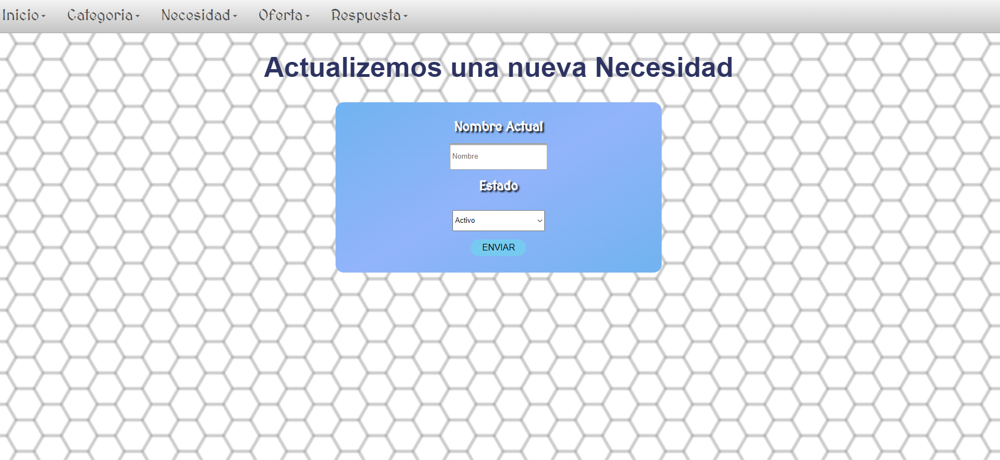
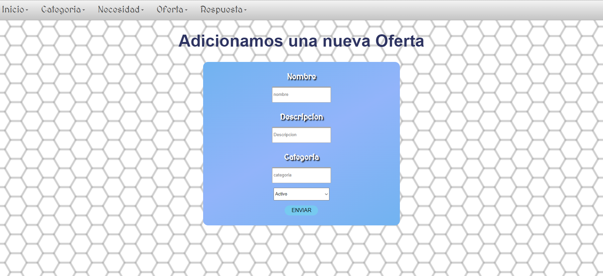
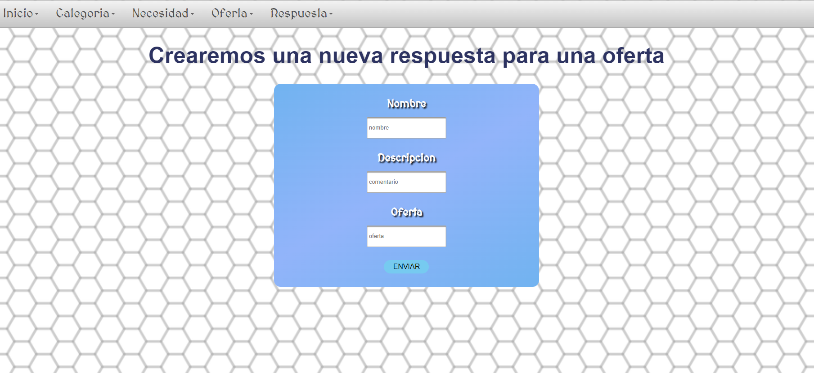
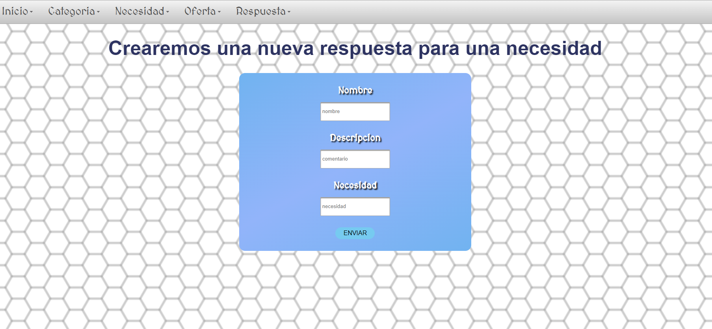

# Proyecto-SoporteSolidario

## Escuela Colombiana de Ingenieria Julio Garavito (ECI)

## Proyecto final de Ciclos del Desarrollo de Software

### Enlace a la app en Heroku

### Enlace a Codacy

### Integrantes

- LEON BALLEN DIEGO ALEJANDRO
- OSPINA CALDERON JUAN SEBASTIAN
- MONROY SIERRA JUAN FELIPE

### Profesor

+ OSPINA RODRIGUEZ OSCAR DAVID (Product Owner)

#### Descripción general

Soporte solidario es una proyecto que busca que la comunidad estudiantil pueda expresar sus necesidades de manera
publica sobre ciertos elementos que requiere para alguna actividad, así, otros miembros de la comunidad tendrán
la oportunidad de brindar estos elementos que son puestos como necesidad. De igual forma los miembros que ayudan
a agregar los elementos, también pueden ofrecer categorías de interés hacia la comunidad que ellos crean que pueda ser
solicitado. La plataforma cuenta con reportes acerca de las categorías, necesidades y ofertas.

### Manual de Usuario
Ingresamos al enlace del Proyecto Solidario [enlace](https://proyecvdssolidaria.herokuapp.com/app/login.xhtml)
Con un usuario y una contraseña que se tienen creada, se puede iniciar sesión al diligenciar la siguiente
forma.

Esta es la plataforma principal donde se tiene un menu que se puede usar para navegar entre la pagina
y un mensaje de bienvenida a los usuarios

En esta parte de la pagina se pueden crear las necesidades

En esta parte de la pagina se pueden actualizar las necesidades

En esta parte de la pagina se pueden crear las ofertas

En esta parte de la pagina se pueden crear las respuestas para las ofertas

En esta parte de la pagina se pueden crear las respuestas para las necesidades

### Usuarios
**Usuario, contraseña, rol**

1. Carlos, 123, Admin

2. Ospina, 12345678, Estudiante 

## Arquitectura y Diseño
### Modelo Entidad-Relación

### Diagrama de clases

### Descripción de la arquitectura

La app esta dividida y formada por 3 capas:

### Capa de presentación 

En esta usamos varias fuentes y tecnologías como:

    * Primefaces(Biblioteca de componentes)
    * W3Schools(Sitio web con ejemplos de html, css, etc.)
   
### Capa de aplicación

En esta otra, usamos otras tecnologías como:
    
    * Java
    * Shiro
    * Google Guice

### Capa de persistencia

En esta capa fue necesario usar un motor de base de datos, en nuestro caso usamos PostgreSQL, 
DBeaver para tener una mejor visualización de estas, y myBatis para mapear sentencias SQL

### Descripción Sprint1

### Descripción Sprint2

