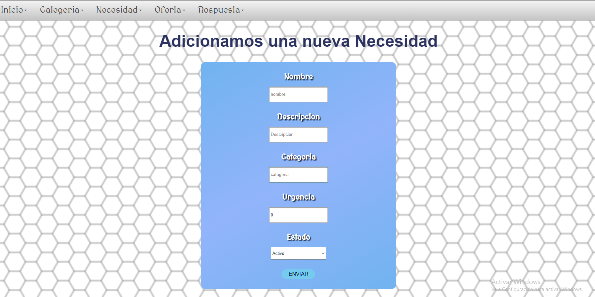

# Proyecto-SoporteSolidario

## Escuela Colombiana de Ingenieria Julio Garavito (ECI)

## Proyecto final de Ciclos del Desarrollo de Software

### Integrantes

- LEON BALLEN DIEGO ALEJANDRO
- OSPINA CALDERON JUAN SEBASTIAN
- MONROY SIERRA JUAN FELIPE

### Profesor

+ OSPINA RODRIGUEZ OSCAR DAVID (Product Owner)

#### Descripcion general

Soporte solidario es una proyecto que busca que la comunidad estudiantil pueda expresar sus necesidades de manera
publica sobre ciertos elementos que requiere para alguna actividad, así, otros miembros de la comunidad tendran
la oportunidad de brindar estos elementos que son puestos como necesidad. De igual forma los miembros que ayudan
a dar los elementos, tambien pueden ofrecer categorias de interes hacia la comunidad que ellos crean que pueda ser
solicitado. La plataforma cuenta con reportes acerca de las categorias, necesidades y ofertas.

### Manual de Usuario
Ingresamos al enlace del Proyecto Solidario [enlace](https://proyecvdssolidaria.herokuapp.com/app/login.xhtml)
Con un usuario y una contraseña que se tienen creada, se puede iniciar sesión al diligenciar la siguiente
forma.

Esta es la plataforma principal donde se tiene un menu que se puede usar para navegar entre la pagina
y un mensaje de bienvenida a los usuarios

En esta parte de la pagina se pueden crear las necesidades

En esta parte de la pagina se pueden actualizar las necesidades

En esta parte de la pagina se pueden crear las ofertas

En esta parte de la pagina se pueden crear las respuestas para las ofertas

En esta parte de la pagina se pueden crear las respuestas para las necesidades

### Enlace a la app en Heroku

### Enlace a Codacy

